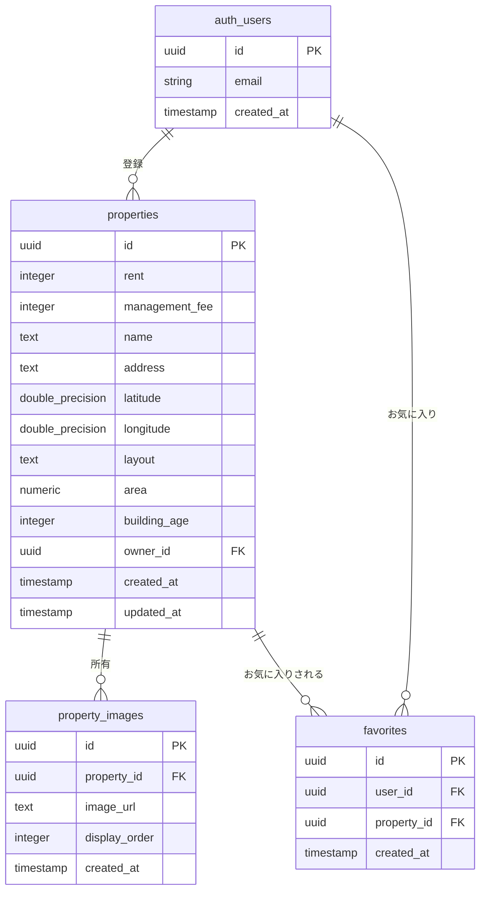

# データベース設計図

## ER図（Mermaid記法）

## テーブル間の関係

1. **auth_users（Supabase認証テーブル）**
   - `properties` テーブルと1対多の関係（1人のユーザーが複数の物件を登録可能）
   - `favorites` テーブルと1対多の関係（1人のユーザーが複数の物件をお気に入り可能）

2. **properties（物件情報テーブル）**
   - `auth_users` テーブルと多対1の関係（複数の物件が1人の所有者に属する）
   - `property_images` テーブルと1対多の関係（1つの物件に複数の画像を保存可能）
   - `favorites` テーブルと1対多の関係（1つの物件が複数のユーザーにお気に入りされる）

3. **property_images（物件画像テーブル）**
   - `properties` テーブルと多対1の関係（複数の画像が1つの物件に属する）

4. **favorites（お気に入りテーブル）**
   - `auth_users` テーブルと多対1の関係（複数のお気に入りが1人のユーザーに属する）
   - `properties` テーブルと多対1の関係（複数のお気に入りが1つの物件に属する）
   - ユニーク制約により、同じユーザーが同じ物件を重複してお気に入りできない
